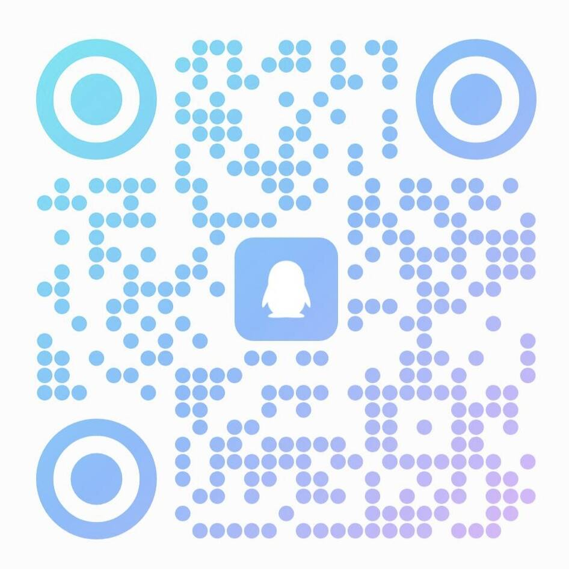
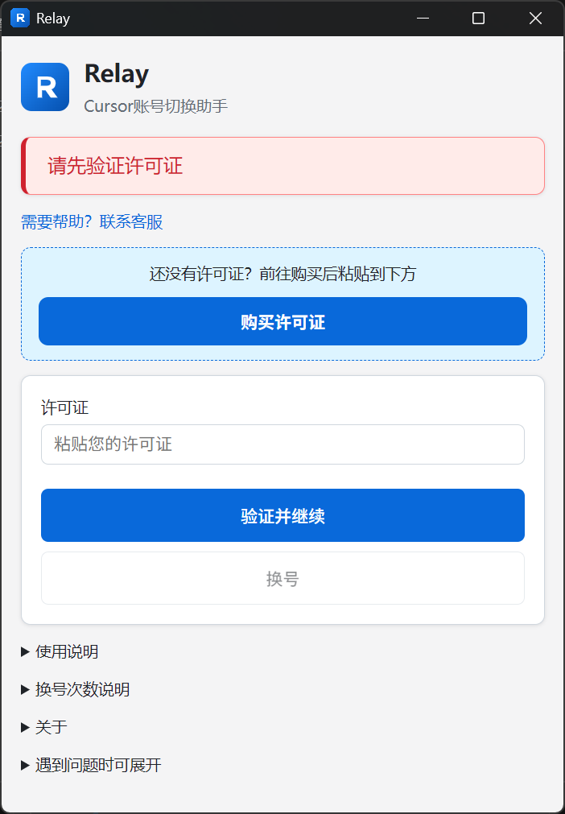
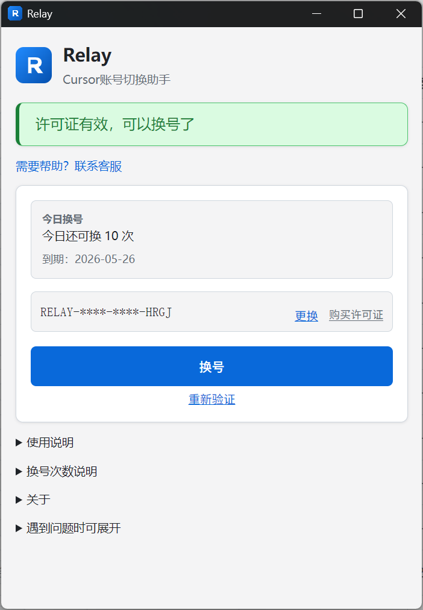

# Relay · Cursor 账号助手

**Cursor 账号切换助手** — 购买许可证并验证后，为本机 Cursor 管理登录状态，按需求灵活购买套餐。

---

### 扫码加入 QQ 群（勿搜索群号），使用交流与问题反馈

也可 [点击链接加群](http://qm.qq.com/cgi-bin/qm/qr?_wv=1027&k=e6rOLUD1dybhaXs5BTr4n1tonVO1yBps&authKey=j56lorByyrvMSYud6dUm9%2FTw4F2vSJjfoiEqvCRDz7CE9RFDc94tl%2FxYKrrU8ngx&noverify=0&group_code=1104541037)

---

## 软件截图

> 客户端支持 **Windows**、**macOS**（下图以 Windows 为例）

| 验证许可证 | 切换账号 |
|:---:|:---:|
|  |  |

---

## 购买

| 商品 | 说明 | 链接 |
|------|------|------|
| **许可证** | 客户端授权与套餐服务，验证后即可使用 | [购买许可证](https://pay.ldxp.cn/shop/632TMTXE) |
| **配套服务** | 更多使用方式与售后支持，请咨询客服 | [加入 QQ 群](http://qm.qq.com/cgi-bin/qm/qr?_wv=1027&k=e6rOLUD1dybhaXs5BTr4n1tonVO1yBps&authKey=j56lorByyrvMSYud6dUm9%2FTw4F2vSJjfoiEqvCRDz7CE9RFDc94tl%2FxYKrrU8ngx&noverify=0&group_code=1104541037) |

---

## 下载

| 系统 | 安装包 |
|------|--------|
| Windows | [Releases](https://github.com/lens68/lens-cursor-free/releases/latest) 中的 `Relay-Setup-*.exe` |
| macOS（Apple 芯片） | `Relay-*-arm64.dmg` |
| macOS（Intel） | `Relay-*-x64.dmg` |

---

## 常见问题

- **macOS 首次打不开？** 未签名安装包可能需对 `.dmg` / `Relay.app` 右键「打开」，或终端执行 `xattr -cr /Applications/Relay.app`。
- **macOS 无法切换账号？** 请安装 **Node.js 22+**（`PATH` 可用，或设置环境变量 `CURSOR_FREE_NODE`）。
- **套餐用完了？** 在商店续期或升级，或 QQ 群联系客服。

---

本仓库公开客户端界面、IPC 与部分基础组件；完整商业能力以 [Releases](https://github.com/lens68/lens-cursor-free/releases) 发布版本为准。

## 免责声明

> [!WARNING]
> - 本工具仅供学习交流，使用本工具所产生的任何后果由使用者自行承担。

---

## 开发者

- [docs/DEVELOPERS.md](docs/DEVELOPERS.md) — 构建与发版
- [CONTRIBUTING.md](CONTRIBUTING.md) — 贡献范围
- [docs/ARCHITECTURE.md](docs/ARCHITECTURE.md) — 架构说明

[MIT](LICENSE)
